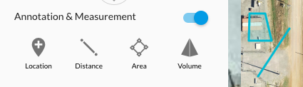

# Annotations

**Overview**



* [Annotations.createMarker](#annotationscreatemarker)
* [Annotations.createLine](#annotationscreateline)
* [Annotations.createArea](#annotationscreatearea)
* [Annotations.delete](#annotationsdelete)
* [Annotations.get](#annotationsget)
* [Annotations.getVolume](#annotationsgetvolume)

## Annotations.createMarker

**Overview**

This function creates an annotation at a specific point.

```javascript
const planId = String;
const location = {
  lat: 35,
  lng: -96
};
const displayOptions = { // optional display options
  description: 'My Marker Annotation'
  color: '#888888'
}
dronedeployApi.Annotations.createMarker(planId, location, displayOptions);
```

## Annotations.createLine

**Overview**

This function creates a line-based annotation based on a series of points.

```javascript
const planId = String;
const geometry = [
  {lat: 35, lng: 35},
  {lat: 35, lng: 36},
  {lat: 36, lng: 36}
];
const displayOptions = { // optional display options
  description: 'My Line Annotation',
  color: '#888888'
}
dronedeployApi.Annotations.createLine(planId, location, displayOptions);
```

## Annotations.createArea

**Overview**

This function creates a polygon annotation given a series of points.

```javascript
const planId = String;
const geometry = [
  {lat: 35, lng: 35},
  {lat: 35, lng: 36},
  {lat: 36, lng: 36},
  {lat: 36, lng: 35}
];
const displayOptions = { //optional display options
  description: 'My Area Annotation',
  color: '#888888',
  fillColor: '#666666' // only relevant for an area annotation
}
dronedeployApi.Annotations.createArea(planId, location, displayOptions);
```

## Annotations.delete

**Overview**

This function deletes a specific annotation.

```javascript
const annotationId: String;
dronedeployApi.Annotations.delete(annotationId);
```

## Annotations.get

**Overview**

This function returns all the annotations for a given plan.

```javascript
const planId = String;
const optionalOptions = {
  comments: boolean, // embed comments into annotations response
};
dronedeployApi.Annotations.get(planId, optionalOptions)
  .then(function(annotations){ console.log(annotations) })
```

**Example Call**

```javascript
dronedeployApi.Annotations.get('5730dc11929d2465038183ab', {comments: true})
  .then(function(annotations){ console.log(annotations) })
```

**Example Response**

```javascript
[
  {
    "info": {
      "geometry": [
        {
          "type": "Coords",
          "value": {
            "lat": 35.92649941843441,
            "lng": -96.7485022544861
          },
          "isPending": false
        }
      ]
    },
    "userId": "56282ec3098f6b3987e2e937",
    "fillColor": "#40ccde",
    "dateModified": 1477425822658,
    "color": "#00bbd3",
    "comments": [],
    "options": 0,
    "geometry": {
      "lat": 35.92649941843441,
      "lng": -96.7485022544861
    },
    "annotationType": "LOCATION",
    "id": "580fba9ecb5fda701d819131",
    "planId": "5730dc11929d2465038183ab",
    "type": "marker",
    "dateCreation": 1477425822658,
    "description": ""
  },
  {
    "info": {
      "geometry": [
        {
          "type": "Area",
          "value": 3935.274554447226,
          "isPending": false
        }
      ]
    },
    "userId": "56282ec3098f6b3987e2e937",
    "fillColor": "#40ccde",
    "dateModified": 1477425814283,
    "color": "#00bbd3",
    "comments": [],
    "options": 0,
    "geometry": [
      {
        "lat": 35.92754630265763,
        "lng": -96.74921572208406
      },
      {
        "lat": 35.927016346401395,
        "lng": -96.74940884113313
      },
      {
        "lat": 35.92681218197787,
        "lng": -96.74877047538757
      },
      {
        "lat": 35.92742467366698,
        "lng": -96.74858808517457
      }
    ],
    "annotationType": "VOLUME",
    "id": "580fba96cb5fda701d819130",
    "planId": "5730dc11929d2465038183ab",
    "type": "polygon",
    "dateCreation": 1477425814283,
    "description": ""
  },
  {
    "info": {
      "geometry": [
        {
          "isPending": false,
          "type": "Length",
          "value": 93.33897899201712
        }
      ]
    },
    "userId": "56282ec3098f6b3987e2e937",
    "fillColor": "#8c6bc8",
    "dateModified": 1476138774860,
    "color": "#6639b6",
    "comments": [
      {
        "text": "one",
        "user": "daniel@dronedeploy.com",
        "timestamp": 1468011401456
      },
      {
        "text": "two",
        "user": "daniel@dronedeploy.com",
        "timestamp": 1468011402317
      },
      {
        "text": "three",
        "user": "daniel@dronedeploy.com",
        "timestamp": 1468011403352
      },
      {
        "text": "four",
        "user": "daniel@dronedeploy.com",
        "timestamp": 1468011404088
      },
      {
        "text": "five",
        "user": "daniel@dronedeploy.com",
        "timestamp": 1468011405104
      },
      {
        "text": "size",
        "user": "daniel@dronedeploy.com",
        "timestamp": 1468011405920
      },
      {
        "text": "slkdjf",
        "user": "daniel@dronedeploy.com",
        "timestamp": 1468011406848
      },
      {
        "text": "skdlfj",
        "user": "daniel@dronedeploy.com",
        "timestamp": 1468011407336
      },
      {
        "text": "kadsjf",
        "user": "daniel@dronedeploy.com",
        "timestamp": 1468011407833
      },
      {
        "text": "akldfj",
        "user": "daniel@dronedeploy.com",
        "timestamp": 1468011408320
      },
      {
        "text": "alkdfja",
        "user": "daniel@dronedeploy.com",
        "timestamp": 1468011408823
      },
      {
        "text": "sdklfj",
        "user": "daniel@dronedeploy.com",
        "timestamp": 1468011409232
      },
      {
        "text": "asdlkfa",
        "user": "daniel@dronedeploy.com",
        "timestamp": 1468011409696
      },
      {
        "text": "dskfas",
        "user": "daniel@dronedeploy.com",
        "timestamp": 1468011410135
      },
      {
        "text": "dkfas",
        "user": "daniel@dronedeploy.com",
        "timestamp": 1468011410535
      },
      {
        "text": "dfkas",
        "user": "daniel@dronedeploy.com",
        "timestamp": 1468011411000
      },
      {
        "text": "fkja",
        "user": "daniel@dronedeploy.com",
        "timestamp": 1468011411482
      },
      {
        "text": "fkjadfkjas",
        "user": "daniel@dronedeploy.com",
        "timestamp": 1468011411882
      },
      {
        "text": "fkjadfkjasdkfas",
        "user": "daniel@dronedeploy.com",
        "timestamp": 1468011412303
      },
      {
        "text": "dkfasd",
        "user": "daniel@dronedeploy.com",
        "timestamp": 1468011412775
      },
      {
        "text": "fkjasd",
        "user": "daniel@dronedeploy.com",
        "timestamp": 1468011413376
      },
      {
        "text": "fljklkasdjf",
        "user": "daniel@dronedeploy.com",
        "timestamp": 1468011414288
      },
      {
        "text": "kdjfa",
        "user": "daniel@dronedeploy.com",
        "timestamp": 1468011414927
      },
      {
        "text": "dskfj",
        "user": "daniel@dronedeploy.com",
        "timestamp": 1468011415544
      },
      {
        "text": "sdkljf",
        "user": "daniel@dronedeploy.com",
        "timestamp": 1468011416376
      },
      {
        "text": "asldkjf",
        "user": "daniel@dronedeploy.com",
        "timestamp": 1468011417503
      },
      {
        "text": "aslkdjf",
        "user": "daniel@dronedeploy.com",
        "timestamp": 1468011418375
      },
      {
        "text": "asdlkjf",
        "user": "daniel@dronedeploy.com",
        "timestamp": 1468011419216
      },
      {
        "text": "adslkjfj",
        "user": "daniel@dronedeploy.com",
        "timestamp": 1468011420063
      },
      {
        "text": "scroll",
        "user": "daniel@dronedeploy.com",
        "timestamp": 1468014897311
      },
      {
        "text": "again",
        "user": "daniel@dronedeploy.com",
        "timestamp": 1468014898302
      },
      {
        "text": "one more",
        "user": "daniel@dronedeploy.com",
        "timestamp": 1468014900302
      },
      {
        "text": "i do not like purple.. ",
        "user": "gerson@dronedeploy.com",
        "timestamp": 1468891733791
      }
    ],
    "options": 0,
    "geometry": [
      {
        "lat": 35.926664485076856,
        "lng": -96.74887508153917
      },
      {
        "lat": 35.92582936181789,
        "lng": -96.74878254532815
      }
    ],
    "annotationType": "LINE",
    "id": "57fc1716cb5fda42e3aacd42",
    "planId": "5730dc11929d2465038183ab",
    "type": "Polyline",
    "dateCreation": 1476138774860,
    "description": "no name? "
  },
  {
    "info": {
      "geometry": [
        {
          "isPending": false,
          "type": "Area",
          "value": 2337.570386649136
        }
      ]
    },
    "userId": "56282ec3098f6b3987e2e937",
    "fillColor": "#d9e46a",
    "dateModified": 1476138774855,
    "color": "#ccdb38",
    "comments": [
      {
        "text": "dfasdf",
        "user": "daniel@dronedeploy.com",
        "timestamp": 1467925757466
      }
    ],
    "options": 0,
    "geometry": [
      {
        "lat": 35.926369099926205,
        "lng": -96.74902260303499
      },
      {
        "lat": 35.92579135195309,
        "lng": -96.74922108650209
      },
      {
        "lat": 35.9256653762706,
        "lng": -96.74896359443666
      },
      {
        "lat": 35.926073710512455,
        "lng": -96.74858272075653
      }
    ],
    "annotationType": "AREA",
    "id": "57fc1716cb5fda42e3aacd41",
    "planId": "5730dc11929d2465038183ab",
    "type": "Polygon",
    "dateCreation": 1476138774855,
    "description": ""
  }
]
```

## Annotations.getVolume

### Note: Arrival 11/1/2016

**Overview**

This function returns the volume information for a volume annotation. DroneDeploy uses this data in the volume annotation detail.


```javascript
const annotationId = String;
dronedeployApi.Annotations.getVolume(annotationId)
  .then(function(volume){ console.log(volume) })
```

**Example Call**

```javascript
dronedeployApi.Annotations.getVolume('581286dccb5fda14db8d2971')
  .then(function(volume){ console.log(volume) })
```

**Example Response**

```javascript
{
  "tiles": [
    [
      121242,
      206011
    ],
    [
      121242,
      206012
    ]
  ],
  "fill_raw": -333.997766494751,
  "linear": true,
  "edge_points": [
    [
      31038034,
      52739050,
      -66.44757270812988
    ],
    [
      31037990,
      52739050,
      -66.44757270812988
    ],
    [
      31037988,
      52739126,
      -66.44757270812988
    ],
    [
      31038052,
      52739126,
      -66.44757270812988
    ]
  ],
  "volume": 529.3595442153552,
  "cut_raw": 9389.320287704468,
  "volume_raw": 9055.322521209717,
  "fill": -19.524970538209864,
  "baseplanetype": "fit",
  "cut": 548.8845147535651,
  "polygon": "POLYGON((-96.74950540065767 35.92691643621745,-96.74962341785431 35.92691643621745,-96.74962878227235 35.92675136694131,-96.74945712089539 35.92675136694131,-96.74950540065767 35.92691643621745))",
  "meters_per_pixel": 0.24178169191004395,
  "order": 1
}
```

** Errors **

If the map is a legacy map and does not support volume annotations the following error will be returned.

```javascript
dronedeployApi.Annotations.getVolume('581286dccb5fda14db8d2971')
  .then(
    function(){},
    function(error){ console.log(error) }
  );
// Map does not support volume annotations.
```


