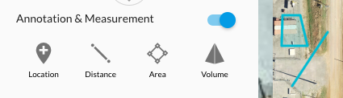
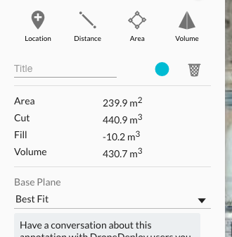

# Annotations

**Overview**



* [Annotations.createMarker](#annotationscreatemarker)
* [Annotations.createLine](#annotationscreateline)
* [Annotations.createArea](#annotationscreatearea)
* [Annotations.createVolume](#annotationscreatevolume)
* [Annotations.delete](#annotationsdelete)
* [Annotations.get](#annotationsget)
* [Annotations.getVolume](#annotationsgetvolume)
* [Annotations.update](#annotationsupdate)

## Annotations.createMarker

**Overview**

This function creates an annotation at a specific point.

```javascript
const planId = String;
const location = {
  lat: 35,
  lng: -96
};
const displayOptions = { // optional display options
  description: 'My Marker Annotation'
  color: '#888888'
}
dronedeployApi.Annotations.createMarker(planId, location, displayOptions);
```

[**Full Example**](annotations/example-annotation-create-and-delete.md)

## Annotations.createLine

**Overview**

This function creates a line-based annotation based on a series of points.

```javascript
const planId = String;
const geometry = [
  {lat: 35, lng: 35},
  {lat: 35, lng: 36},
  {lat: 36, lng: 36}
];
const displayOptions = { // optional display options
  description: 'My Line Annotation',
  color: '#888888'
}
dronedeployApi.Annotations.createLine(planId, location, displayOptions);
```

[**Full Example**](annotations/example-annotation-create-and-delete.md)

## Annotations.createArea

**Overview**

This function creates a polygon annotation given a series of points.

```javascript
const planId = String;
const geometry = [
  {lat: 35, lng: 35},
  {lat: 35, lng: 36},
  {lat: 36, lng: 36},
  {lat: 36, lng: 35}
];
const displayOptions = { //optional display options
  description: 'My Area Annotation',
  color: '#888888',
  fillColor: '#666666' // only relevant for an area annotation
}
dronedeployApi.Annotations.createArea(planId, location, displayOptions);
```

[**Full Example**](annotations/example-annotation-create-and-delete.md)

## Annotations.createVolume

Ceates a polygon annotation given a series of points. Very similiar to area annotation but volume information can be retrieved with [getVolume](#annotationsgetvolume).

```javascript
const planId = String;
const geometry = [
  {lat: 35, lng: 35},
  {lat: 35, lng: 36},
  {lat: 36, lng: 36},
  {lat: 36, lng: 35}
];
const displayOptions = { //optional display options
  description: 'My Area Annotation',
  color: '#888888',
  fillColor: '#666666' // only relevant for an area annotation
}
dronedeployApi.Annotations.createArea(planId, location, displayOptions)
  .then(function(annotationId){
    return dronedeployApi.Annotations.getVolume(annotationId);
  }).then(function(volumeInformation){
    console.log(volumeInformation);
  })
```

## Annotations.delete

**Overview**

This function deletes a specific annotation.

```javascript
const annotationId: String;
dronedeployApi.Annotations.delete(annotationId);
```

[**Full Example**](annotations/example-annotation-create-and-delete.md)

## Annotations.get

**Overview**

This function returns all the annotations for a given plan.

```javascript
const planId = String;
const optionalOptions = {
  comments: boolean, // embed comments into annotations response
};
dronedeployApi.Annotations.get(planId, optionalOptions)
  .then(function(annotations){ console.log(annotations) })
```

**Example Call**

```javascript
dronedeployApi.Annotations.get('5730dc11929d2465038183ab', {comments: true})
  .then(function(annotations){ console.log(annotations) })
```

[**Full Example**](/annotations/example-annotations.get.md)

**Example Response**

```javascript
[
  {
    "info": {
      "geometry": [
        {
          "type": "Coords",
          "value": {
            "lat": 35.92649941843441,
            "lng": -96.7485022544861
          },
          "isPending": false
        }
      ]
    },
    "userId": "56282ec3098f6b3987e2e937",
    "fillColor": "#40ccde",
    "dateModified": 1477425822658,
    "color": "#00bbd3",
    "comments": [],
    "options": 0,
    "geometry": {
      "lat": 35.92649941843441,
      "lng": -96.7485022544861
    },
    "annotationType": "LOCATION",
    "id": "580fba9ecb5fda701d819131",
    "planId": "5730dc11929d2465038183ab",
    "type": "marker",
    "dateCreation": 1477425822658,
    "description": ""
  },
  {
    "info": {
      "geometry": [
        {
          "type": "Area",
          "value": 3935.274554447226,
          "isPending": false
        }
      ]
    },
    "userId": "56282ec3098f6b3987e2e937",
    "fillColor": "#40ccde",
    "dateModified": 1477425814283,
    "color": "#00bbd3",
    "comments": [],
    "options": 0,
    "geometry": [
      {
        "lat": 35.92754630265763,
        "lng": -96.74921572208406
      },
      {
        "lat": 35.927016346401395,
        "lng": -96.74940884113313
      },
      {
        "lat": 35.92681218197787,
        "lng": -96.74877047538757
      },
      {
        "lat": 35.92742467366698,
        "lng": -96.74858808517457
      }
    ],
    "annotationType": "VOLUME",
    "id": "580fba96cb5fda701d819130",
    "planId": "5730dc11929d2465038183ab",
    "type": "polygon",
    "dateCreation": 1477425814283,
    "description": ""
  },
]
```

[**Full Example**](annotations/example-annotations.get.md)

## Annotations.getVolume

**Overview**

This function returns the volume information for a volume annotation. DroneDeploy uses this data in the volume annotation detail.



```javascript
const annotationId = String;
dronedeployApi.Annotations.getVolume(annotationId)
  .then(function(volume){ console.log(volume) })
```

**Example Call**

```javascript
dronedeployApi.Annotations.getVolume('581286dccb5fda14db8d2971')
  .then(function(volume){ console.log(volume) })
```

**Example Response**

```javascript
{
  "tiles": [
    [
      121242,
      206011
    ],
    [
      121242,
      206012
    ]
  ],
  "fill_raw": -333.997766494751,
  "linear": true,
  "edge_points": [
    [
      31038034,
      52739050,
      -66.44757270812988
    ],
    [
      31037990,
      52739050,
      -66.44757270812988
    ],
    [
      31037988,
      52739126,
      -66.44757270812988
    ],
    [
      31038052,
      52739126,
      -66.44757270812988
    ]
  ],
  "volume": 529.3595442153552,
  "cut_raw": 9389.320287704468,
  "volume_raw": 9055.322521209717,
  "fill": -19.524970538209864,
  "baseplanetype": "fit",
  "cut": 548.8845147535651,
  "polygon": "POLYGON((-96.74950540065767 35.92691643621745,-96.74962341785431 35.92691643621745,-96.74962878227235 35.92675136694131,-96.74945712089539 35.92675136694131,-96.74950540065767 35.92691643621745))",
  "meters_per_pixel": 0.24178169191004395,
  "order": 1
}
```

[**Full Example**](/annotations/example-annotations.getvolume.md)

** Errors **

If the map is a legacy map and does not support volume annotations the following error will be returned.

```javascript
dronedeployApi.Annotations.getVolume('581286dccb5fda14db8d2971')
  .then(
    function(){},
    function(error){ console.log(error) }
  );
// Map does not support volume annotations.
```

[**Full Example**](annotations/example-annotations.getvolume.md)

## Annotations.update

**Overview**

This function enables updates to existing annotation properties. Valid properties include:
- `color`
- `description`
- `geometry`

```javascript
const existingAnnotationId = String;
// NOTE: None of the properties are required, can include one or more
const propertiesToUpdate = {
  color: '#888888' // must be a hex value, annotation fill color automatically derived from color value
  description: 'My new annotation description',
  geometry: [
    { lat: 35, lng: 36 },
    { lat: 33, lng: 34 },
    { lat: 30, lng: 31 },
  ],
};
dronedeployApi.Annotations.update(existingAnnotationId, propertiesToUpdate)
  .then(function() {
    // do stuff after update
  })
  .catch(function(err) {
    // something went wrong with the update
    console.log(err);
  });
```
