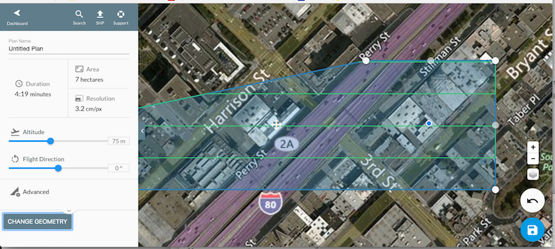

# Change Flight Geometry



```html
<!DOCTYPE html>
<html lang="en">
<head>
  <meta charset="UTF-8">
  <title>Change Geometry</title>
  <link rel="stylesheet" href="styles.css">
  <style>
  .button {
    background-color: #4CAF50;
    border: none;
    color: white;
    padding: 15px 32px;
    text-align: center;
    text-decoration: none;
    display: inline-block;
    font-size: 16px;
    margin: 4px 2px;
    cursor: pointer;
  }
  </style>
</head>
<body>

  <a href="#" class="button">Change Geometry</a>

  <script>
  function randomlyAdjustGeometry(geometry){
    var offset = Math.random() / 100 * ([1, -1][Math.floor(Math.random() * 2)]);
    geometry[2].lng = geometry[0].lng + offset;
    return geometry;
  }

  document.querySelector('.button').addEventListener('click', function(){
    new DroneDeploy({version: 1}).then(function(dronedeployApi){
      dronedeployApi.Plans.getCurrentlyViewed()
        .then(function(plan){
          var newGeometry = randomlyAdjustGeometry(plan.geometry);
          dronedeployApi.Plans.update(plan.id, {geometry: newGeometry});
        });
    });
  });
  </script>


</body>
</html>
```


