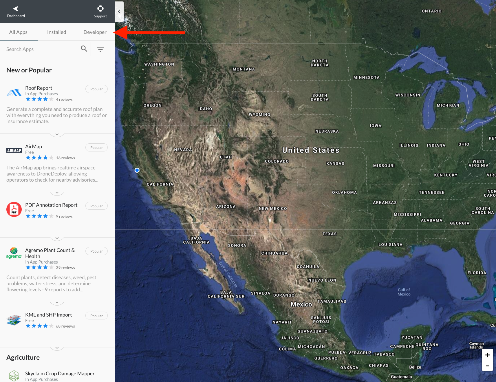
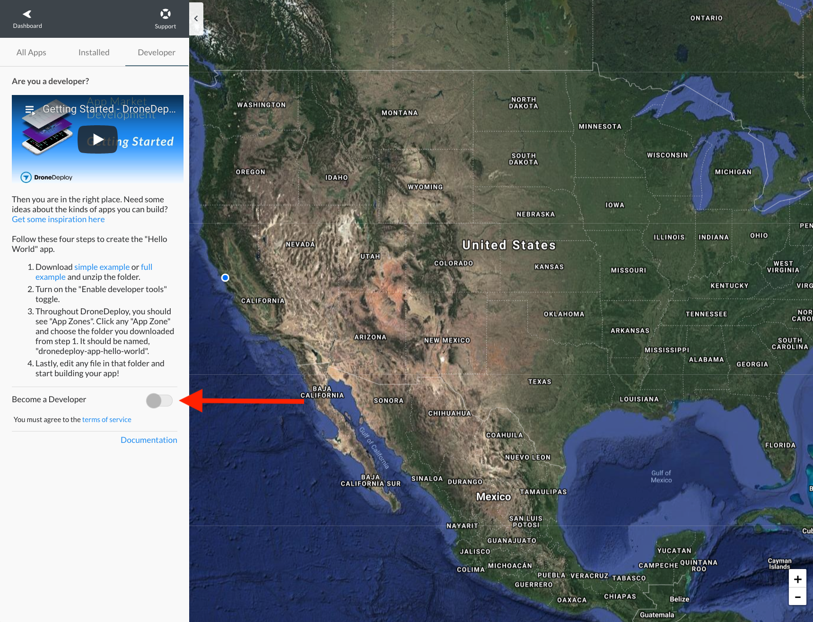
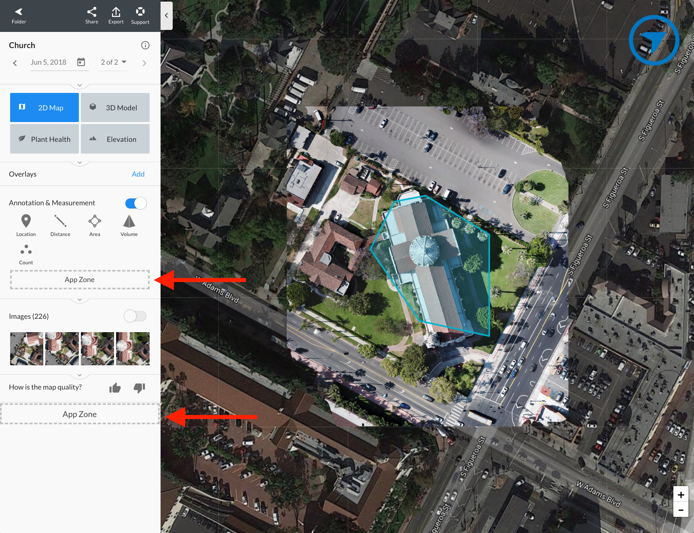

# Turning on Developer Mode

Developer mode is the way with which you can display DroneDeploy App Zones - areas within the UI where you can have apps.

You can enable Developer mode with the following steps:

1. Navigate into the App Market

1. Navigate to the Developer tab

1. Turn on Developer mode. Note that you may need to accept the developer agreements below the toggle.

1. If you navigate to various parts of DroneDeploy, you should see App Zones
