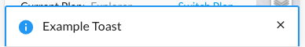

# Messaging
## Messaging.showToast
**Overview**



```javascript
const message = String;
const optionalOptions = {timeout: Number};
dronedeployApi.Messaging.showToast(message, optionalOptions)
  .then(function(toastObj){ console.log(toastObj) });
```

**Examples**
```javascript
dronedeployApi.Messaging.showToast('Example Toast');
```

```javascript
// timeout after 5 seconds
dronedeployApi.Messaging.showToast('Example Toast', {timeout: 5000});
```

```javascript
const neverTimeout = -1;
dronedeployApi.Messaging.showToast('Example Toast', {timeout: neverTimeout})
  .then(function(toastObj){
    // Programmatically remove a toast
    setTimeout(() => toastObj.remove(), 1000)
  });
```

**Response**

```javascript
{
  // Remove the toast from the screen
  remove: Function
}
```


**[Full Example](/messaging/example-messaging.showtoast.md)**
