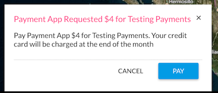

# Payments

https://www.youtube.com/watch?v=Vj_20LZozQ0&list=PLqOge_z8yN2EJ4ftDaY1XdbaneCRQTnvq&index=5


* [Payments.charge](#paymentscharge)
* [Payment FAQ](#how-to-validate-or-cancel-a-payment)

## Payments.charge

#### Overview

This call allows your app to ask the user for a one time payment. Users must have a paid account to run paid apps. Payments will processed at the end of the month. When you request a payment, the user will see a request.



**Parameters**

```javascript
const amount = Number;
const paymentFor = String;
dronedeployApi.Payments.charge(amount, paymentFor);
```

#### Example Call

```javascript
dronedeployApi.Payments.charge(4.00, 'Testing Payments')
  .then(
    function(success){ console.log('paymentId:', success) },
    function(error){ console.log(error) }
  )
```

**Note:** If your app is not published the returned paymentId is fake and is not saved to our database. Additionally, having a paid account is not enforced while in development.

Here is a screenshot of what you would see if your app is not published.  

#### Example Response

**Success Response**

If the payment is successful you will receive the payment id.

```javascript
...then(function(paymentId){ console.log(paymentId) })
// 298348de72987ac
```

**Error Responses**

If the user clicks cancel on the payment request.

```javascript
.then(
  function(){},
  function(error){ console.log(error) },
)
// Error('User declined payment request.')
```

If the user does not have a paid account.

```javascript
.then(
  function(){},
  function(error){ console.log(error) },
)
// Error('User does not have a paid account.')
```

If the request fails \(I.E. the user is offline\).

```javascript
.then(
  function(){},
  function(error){ console.log(error) },
)
// Error('Error Submitting Payment')
```

**[Full Example](/payments/example-payments.charge.md)**

## Payment FAQ

### How to validate or cancel a payment?

1 - From the account that authored the plugin get your [API key here](https://www.dronedeploy.com/app/settings)

2 - Run _GET_ against this endpoint with your payment\_id, _/v1/plugin\_payments/&lt;payment\_id&gt;_

```
curl "https://public-api.dronedeploy.com/v1/plugin_payments/5817d4b9361143b45cbb072b?api_key=f78b0a0d66274fd5a8684c49deb9d83d"
```

Example Response

```
{
    "user_id": "57c5fc90dd32274105595f92", 
    "description": "Paid for something", 
    "date_creation": 1234567890100, 
    "date_paid": null, 
    "amount": 1000, 
    "plugin_id": "5817d4b6361143b45cbb072a", 
    "id": "5817d4b9361143b45cbb072b"
}
```

3 - To cancel a payment run _PUT_ against _/v1/plugin\_payments/&lt;payment\_id&gt;_ with _{"status": "cancelled"}_ as the body.

```
curl -X PUT -H "Content-Type: application/json" -d '{"status":"cancelled"}' "https://public-api.dronedeploy.com/v1/plugin_payments/589e239dc66a510001bd330b?api_key=65452af2874547428a90d008a8ed75dc"
```

[Read more about our REST API.](http://support.dronedeploy.com/v1.0/docs/data-api-access)

