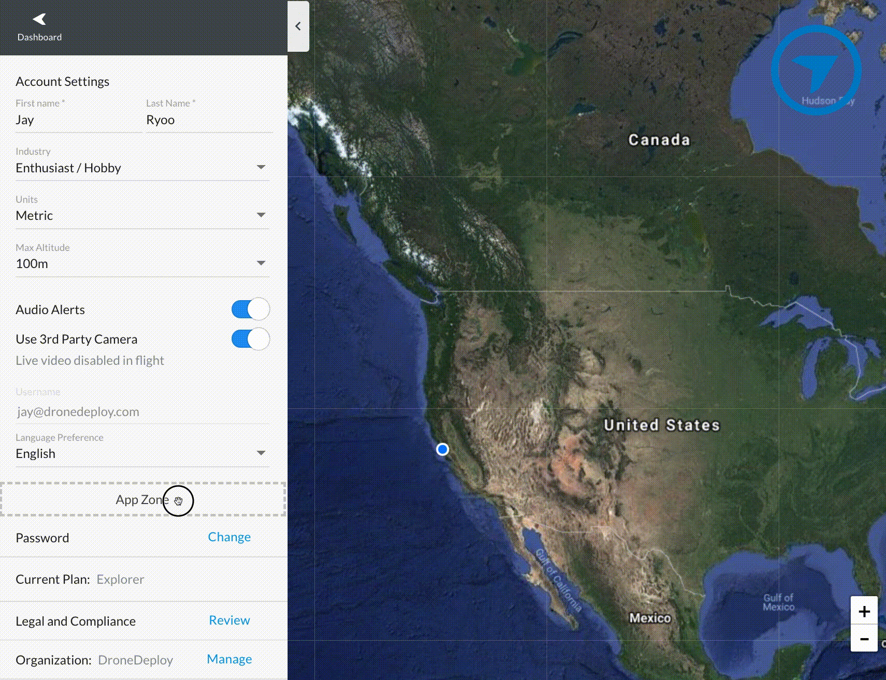

# Getting Started

## Pre-requisites

1. [Create an account](https://www.dronedeploy.com/signup.html) on DroneDeploy if you do not have one already.
1. Become a [DroneDeploy Developer](../developer-mode/developer.md)
1. Request an API key by contacting [developer@dronedeploy.com](developer@dronedeploy.com) if you do not already have one.

## Sample App

To get you started, we have created a sample app. By deploying this sample app, you will learn to use every aspect of the DroneDeploy SDK.

### Overview

The app you will be deploying will enable the following flow:
1. A user creates an export
1. When the export completes, an export complete Trigger will go off
1. The trigger will call out to your DroneDeploy Function
1. The DroneDeploy Function will call to your IFTTT webhook endpoint

### Installation
1. You will need to have [npm](https://www.npmjs.com/) and [node.js](https://nodejs.org/en/) installed. Note that we currently support node.js 6 runtime `6.14.0`
1. First clone the open-sourced [app-examples](https://github.com/dronedeploy/app-examples) repository

        $ git clone git@github.com:dronedeploy/app-examples.git

1. We use the [serverless](https://serverless.com/) platform for deployment. You will need to install this globally

        $ npm install -g serverless

1. Navigate to the IFTTT example

        $ cd app-examples/IFTTT

1. Install the dependencies

        $ npm install

### App Deployment
1. Navigate to the settings page and add the `IFTTT/app` directory to the App Zone

    

1. Go to the App Market Installed Apps tab to see your new app listed. Go and change the name from `app` to `IFTTT` and copy the App ID.

    

1. Copy the App ID into your `serverless.yml` file in the `app` field

    

1. 

### IFTTT Setup