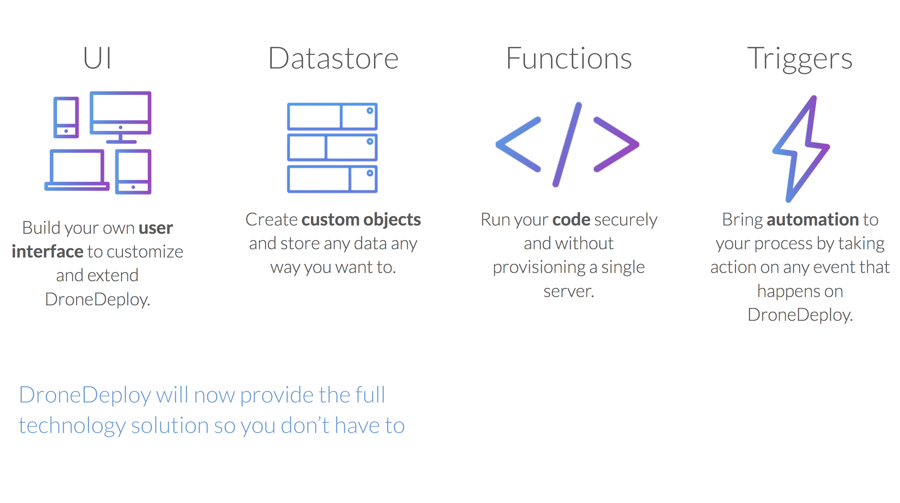
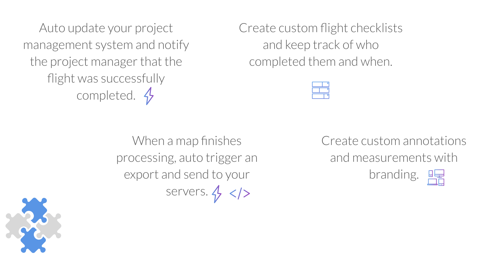

# DroneDeploy App SDK (BETA)

### Note that this is a BETA and things are subject to change.

## Overview

Welcome to the DroneDeploy App SDK Beta.

We are very excited to share what we have been working on and have you try out the latest app development tools from DroneDeploy.

The new App SDK introduces three main features:

* [**Datastore**](datastore.md): create custom tables to store data however you want

* [**Functions**](functions.md): run your server code securely on DroneDeploy. Don’t worry about hosting ever again

* [**Triggers**](triggers.md): take action on DroneDeploy events like “processing complete” and “export complete” and bring automation to your apps

Combined with the existing UI Kit, you will have full control and resources to build out the most powerful apps and integrations on DroneDeploy.

