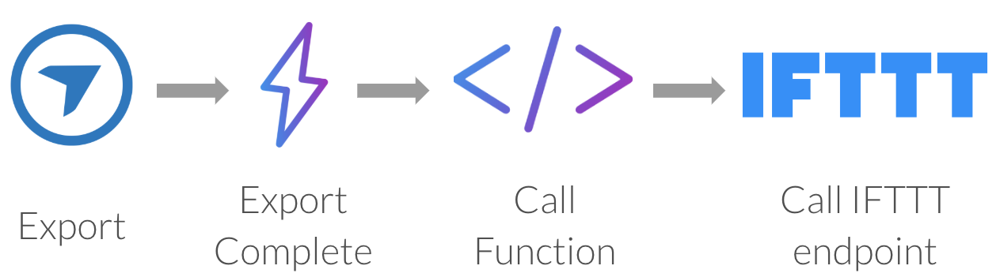
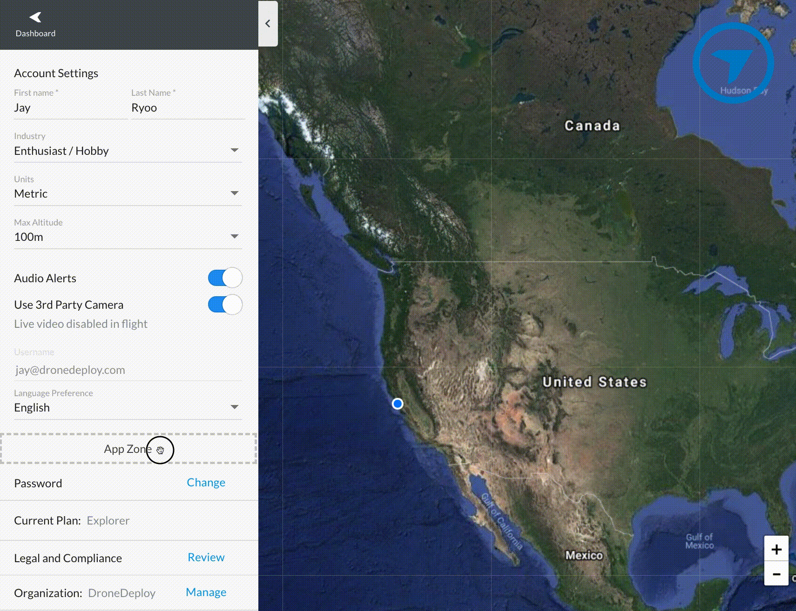
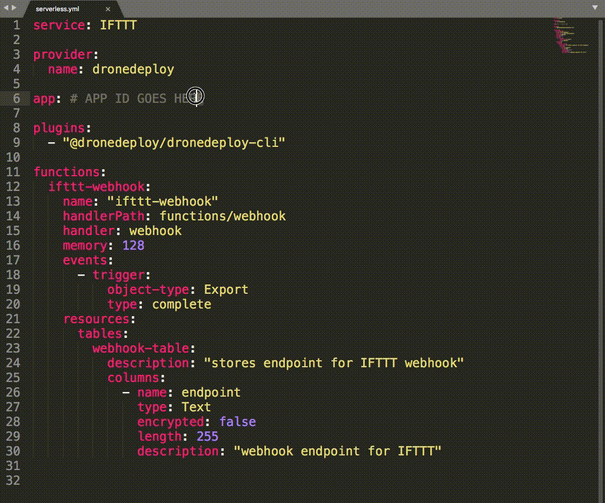
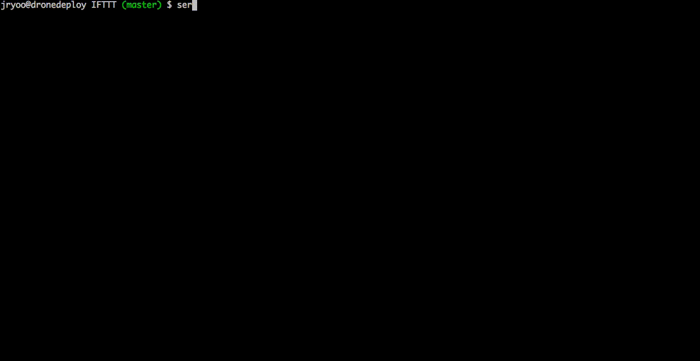
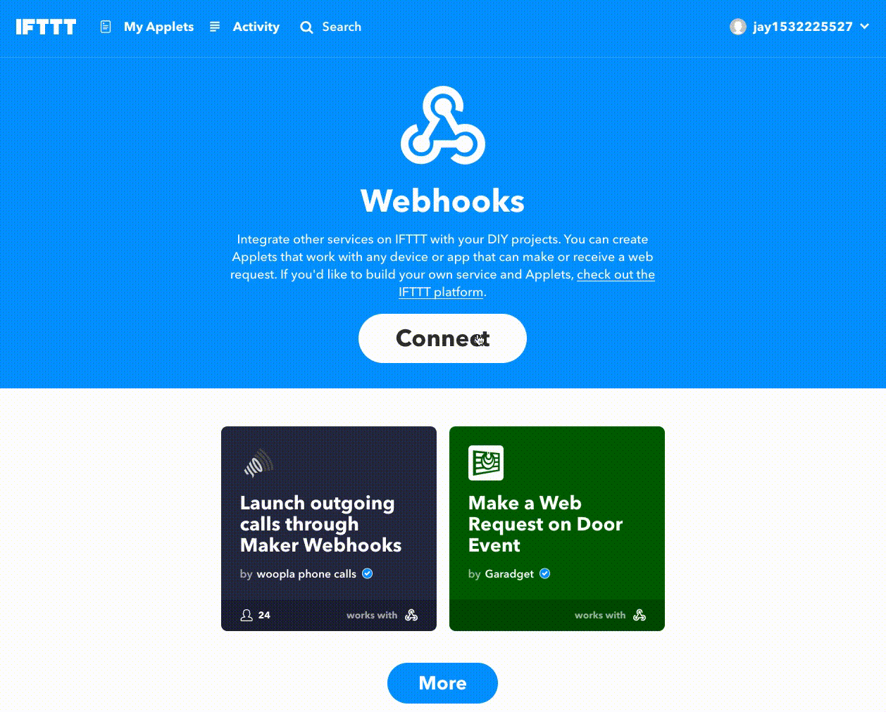
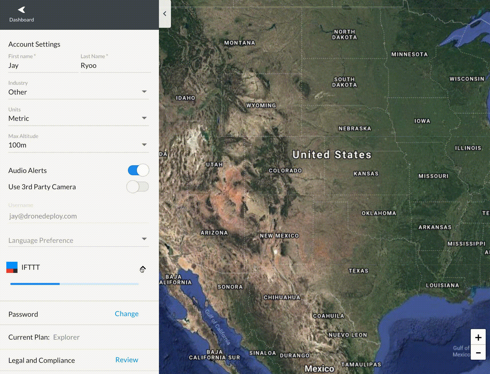

# Getting Started

## Prerequisites

1. [Create an account](https://www.dronedeploy.com/signup.html) on DroneDeploy if you do not have one already.
1. Become a [DroneDeploy Developer](../developer-mode/developer.md)
1. Request an API key by contacting [developer@dronedeploy.com](mailto:developer@dronedeploy.com) if you do not already have one.

## Sample App

To get you started, we have created a sample app. By deploying this sample app, you will learn to use every aspect of the DroneDeploy SDK.

### Overview

The app you will be deploying will enable the following flow:
1. A user creates an export
1. When the export completes, an export complete Trigger will go off
1. The Trigger will call out to your DroneDeploy Function
1. The DroneDeploy Function will call to your IFTTT webhook endpoint

### Installation
1. You will need to have [npm](https://www.npmjs.com/) and [node.js](https://nodejs.org/en/) installed. Note that we currently support node.js 6 runtime `6.14.0`
1. First clone the open-sourced [app-examples](https://github.com/dronedeploy/app-examples) repository

        $ git clone git@github.com:dronedeploy/app-examples.git

1. We use the [serverless](https://serverless.com/) platform for deployment. You will need to install this globally

        $ npm install -g serverless

1. Navigate to the IFTTT example

        $ cd app-examples/IFTTT

1. Install the dependencies. This will install the [dronedeploy-cli](dronedeploy-cli.md), which is a development tool to make App Development much easier.

        $ npm install

1. Add your API key to [dronedeploy-cli](dronedeploy-cli.md)

        $  serverless config credentials --provider=dronedeploy --key=<YOUR API KEY>

### App Deployment
1. Navigate to the settings page and add the `IFTTT/app` directory to the App Zone

    

1. Go to the App Market Installed Apps tab to see your new app listed. Go and change the name from `app` to `IFTTT` and copy the App ID.

    

1. Press the "Deploy For Mobile Testing" button to checkpoint your app and to make the app available on mobile.

1. Copy the App ID into your `serverless.yml` file in the `app` field

    

1. Now you are ready to deploy the app with the following command

        $ serverless deploy

    Note that this will do the following:
    1. Deploy the defined `ifttt-webhook` Function
    1. Deploy the Export Complete Function Trigger
    1. Deploy the `webhook-table` Datastore table

    The deployment should look something like this:

    

1. If everything went according to plan, you should now have a Datastore table, a DroneDeploy Function, and a Trigger definition!

### IFTTT Setup

1. [Sign up](https://ifttt.com/join) for an IFTTT account if you do not have one already.

1. Go to the IFTTT [webhooks service page](https://ifttt.com/maker_webhooks) and activate it by pressing `Connect`, then generate a new webhook endpoint by going into the `documentation` page. Enter in `dronedeploy` as the event name and copy the webhook endpoint.

    

1. The URL should look something like this

        https://maker.ifttt.com/trigger/dronedeploy/with/key/calBarcsa1DcqmSN9_D1acb

1. Copy and paste your URL into your App UI and press save. This will save this URL by passing the URL string to the `ifttt-webhook` function, which will then save the URL to the defined `webhook-table` Datastore table. Try refreshing the page and opening the app - you will notice that your URL is still there and now persisted in your Datastore!

    

1. [Create an Applet](https://ifttt.com/create) on IFTTT using your new IFTTT webhook service as the trigger. Don't forget to select the Webhook at the service and set the event to **dronedeploy**. In this GIF, we are showing an Applet that emails you when a trigger fires. You can find more documentation about how to build an IFTTT Applet [here](https://ifttt.com/blog/2017/05/how-to-build-an-applet).

    

1. Now if you perform a DroneDeploy map export, you should get an event in IFTTT! When an event triggers, you will see that your IFTTT Applet ran under the [activity](https://ifttt.com/activity) tab.

## Next Steps

Learn more about how to extend the sample app or build your own from scratch [here](app-development.md).
