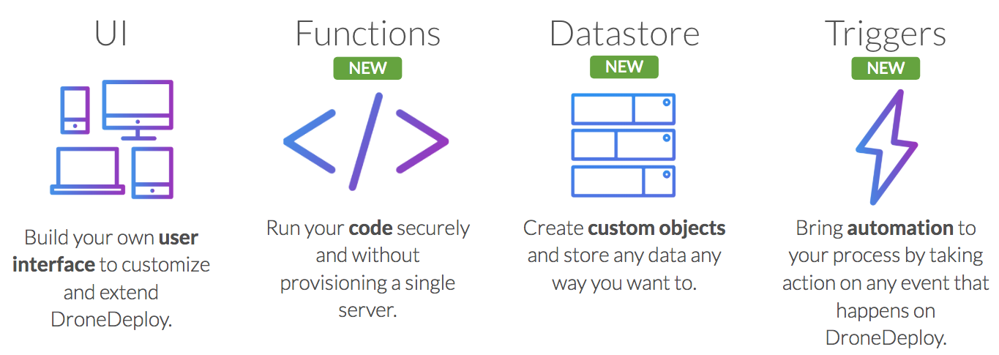
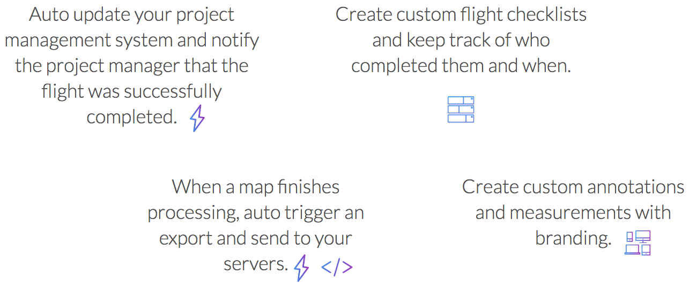

# DroneDeploy App SDK

## Overview

Welcome to the DroneDeploy App SDK. We are very excited to share with you what we have been working on to help you make the most out of the DroneDeploy Platform. By participating, you will have access to the latest features of the DroneDeploy Platform and also have an impact and influence over the product roadmap.

The new App SDK introduces three main features in addition to the existing UI platform:

* [**UI**](ui-kit.md): Build a custom user interface

* [**Functions**](functions.md): Serverless architecture running on the DroneDeploy Platform. Write Node.js code to enable backend functionality.

* [**Datastore**](datastore.md): Create custom data tables with columns and schema. Store customer data securely.

* [**Triggers**](triggers.md): Build DroneDeploy event driven use cases.

## Usecases

With these new features, we are unlocking new use cases that were not possible before. We list some ideas below, but we cannot wait to see what amazing new ideas you come up with.

## Getting Started

[Get started](getting-started.md) with our sample app and deploy your first DroneDeploy app!
