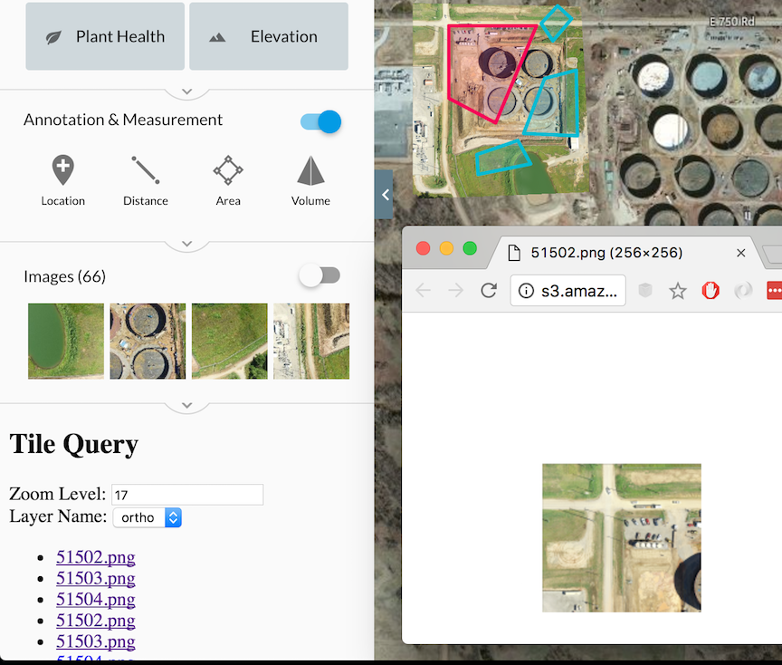

# Get Tiles



```html
<!DOCTYPE html>
<html lang="en">
<head>
  <meta charset="UTF-8">
  <title>Document</title>
  <style>
  .tile-links{
    height: 100px;
    overflow: scroll;
  }
  </style>
</head>
<body>

<h2>Tile Query</h2>
<label for="">Zoom Level: </label>
<input type="text" value="17" id="zoomLevel">
<br>
<label for="">Layer Name: </label>
<select id="layerName">
  <option value="ortho">ortho</option>
  <option value="dem">dem</option>
</select>

<ul class="tile-links"></ul>

<script>
const zoom = document.querySelector('#zoomLevel');
const layer = document.querySelector('#layerName');
const tileList = document.querySelector('.tile-links');

function dronedeployApiReady(){
  return new Promise((resolve) => {
    window.dronedeploy.onload(() => {
      resolve();
    });
  });
}
function getListItemFromLink(linkUrl){
  const last = (array) => array.slice(-1)[0];
  return `<li><a href="${linkUrl}" target="_blank">${last(linkUrl.split('/'))}</a></li>`;
}

function drawTileLinksToScreen(links){
  tileList.innerHTML = links.map(getListItemFromLink).join('');
}

function fetchTileDataFromPlan(plan){
  return window.dronedeploy.Tiles.get({planId: plan.id, layerName: layer.value, zoom: parseInt(zoom.value)});
}

function getTilesFromResponse(tileResponse){
  return tileResponse.tiles;
}

function updateTileLinks(){
  dronedeployApiReady()
    .then(() => dronedeploy.Plans.getCurrentlyViewed())
    .then(fetchTileDataFromPlan)
    .then(getTilesFromResponse)
    .then(drawTileLinksToScreen)
}

zoom.addEventListener('change', updateTileLinks);
layer.addEventListener('change', updateTileLinks);
updateTileLinks();

</script>

</body>
</html>
```


